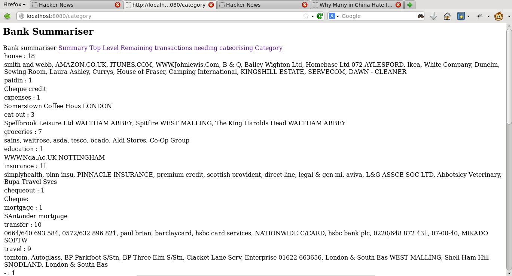

==============
MyHomeAccounts
==============

MyHomeAccounts started life as a way for me to feel productive whilst not
actually reviewing my financial accounts.  I wrote a program that would import
all my bank statements, my wife's statements, add them up and categorise them
and show us where we were going wrong (or right).

And having got it to import, and categorise, I simply stopped there, exhausted,
and never actually *dealt with* any of the financial issues.

However, I have reawakened the project a little, and will be using it here to
work through how to do some BDD, TDD, some new-form Javascript working and a
little design brush up.

And throughout this I shall be trying my very best to apply uncle Bob's Clean
Code principles.

So...

1. Where are we now?

2. base functionality

3. TDD, and unit testing

4. BDD and functional testing, and Bootstrap

5. moving into the client with Angular JS

Where are we now?
-----------------

It does not look good.  It's partly a web app, partly some hand coding and 
partly command line.  It has a UI only it's mother could love

.. toctree::
    
   modules

